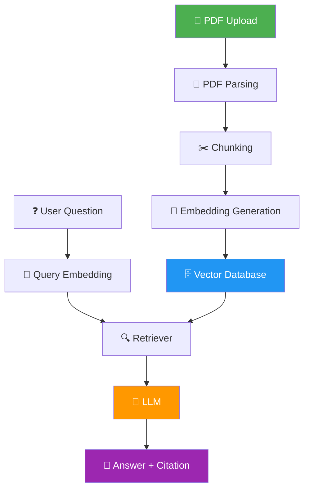

<div align="center">

# 📚 DocPilot

**Ask questions about any PDF document and get answers with citations and page numbers.**

[](https://python.org)
[](https://fastapi.tiangolo.com)
[](https://streamlit.io)
[](LICENSE)

</div>

---

## 📋 Problem Statement

Reading through long PDF documents to find specific information is time-consuming and inefficient. **DocPilot** solves this by building a Retrieval-Augmented Generation (RAG) pipeline that lets users upload PDF documents, ask natural-language questions, and receive precise answers with **citations and page numbers** — grounded in the actual document content.

## 🏷️ Project Info

| Field | Value |
|-------|-------|
| **Segment** | Foundations of Applied Machine Learning |
| **Project Code** | I2 – Document Q&A (RAG) |
| **Author** | [Aaryan Godara](https://github.com/aaryan-godara) |

---

## ✨ Features (Planned)

- [x] PDF document upload via web UI
- [x] FastAPI backend with health monitoring
- [x] Structured logging and configuration
- [ ] PDF parsing and text extraction
- [ ] Intelligent text chunking with overlap
- [ ] Embedding generation using Sentence Transformers
- [ ] Vector storage and retrieval with ChromaDB
- [ ] LLM-powered answer generation with OpenAI
- [ ] Citations with page numbers in responses
- [ ] Multi-document support
- [ ] Conversation history and follow-up questions
- [ ] Dockerized deployment

---

## 🏗️ Architecture Overview



> **Current scope (Week 1):** Only the PDF Upload → Backend storage path is implemented. The full RAG pipeline will be built in Weeks 2–4.

---

## 🛠️ Tech Stack

| Category | Technology | Purpose |
|----------|-----------|---------|
| **Language** | Python 3.10+ | Core application language |
| **Backend** | FastAPI | REST API server |
| **Frontend** | Streamlit | Interactive web interface |
| **PDF Processing** | PyMuPDF | Text extraction from PDFs |
| **LLM Framework** | LangChain | RAG pipeline orchestration |
| **LLM Provider** | OpenAI SDK | Answer generation |
| **Embeddings** | Sentence Transformers | Document & query embeddings |
| **Vector Database** | ChromaDB | Similarity search & storage |
| **Containerization** | Docker | Deployment & reproducibility |
| **Version Control** | Git + GitHub | Source management |

---

## 📁 Folder Structure

```
DocPilot/
│
├── app/
│   ├── frontend/              # Streamlit UI
│   │   └── streamlit_app.py
│   ├── backend/               # FastAPI server
│   │   ├── main.py            # App entry point
│   │   ├── config.py          # Settings & env vars
│   │   └── routes/
│   │       ├── health.py      # Health check endpoint
│   │       └── upload.py      # PDF upload endpoint
│   └── utils/
│       └── logger.py          # Logging configuration
│
├── data/
│   ├── raw/                   # Uploaded PDFs
│   ├── processed/             # Chunked & embedded data
│   └── sample/                # Sample documents for testing
│
├── docs/
│   ├── design_doc.md          # Design document
│   ├── architecture.md        # Architecture deep-dive
│   └── adr/                   # Architecture Decision Records
│
├── notebooks/                 # Jupyter notebooks for experiments
├── tests/                     # Unit & integration tests
├── scripts/                   # Utility scripts
│
├── requirements.txt           # Python dependencies
├── docker-compose.yml         # Container orchestration
├── .env.example               # Environment variable template
├── .gitignore
├── LICENSE
└── README.md
```

---

## 📊 Current Progress

| Component | Status |
|-----------|--------|
| Project structure | ✅ Complete |
| README & documentation | ✅ Complete |
| Design document | ✅ Complete |
| Architecture document | ✅ Complete |
| FastAPI server | ✅ Complete |
| Health endpoint | ✅ Complete |
| Upload endpoint | ✅ Complete |
| Streamlit frontend | ✅ Complete |
| Logging & configuration | ✅ Complete |
| PDF parsing | 🔲 Week 2 |
| Chunking & embeddings | 🔲 Week 2 |
| Vector database | 🔲 Week 3 |
| RAG pipeline | 🔲 Week 3 |
| Answer generation | 🔲 Week 4 |

---

## 📅 Week 1 Progress

- [x] Initialized project repository with clean folder structure
- [x] Created comprehensive README with architecture overview
- [x] Wrote design document with requirements and timeline
- [x] Wrote architecture document with component breakdown
- [x] Set up FastAPI backend with CORS and lifecycle management
- [x] Implemented `GET /health` endpoint
- [x] Implemented `POST /upload` endpoint for PDF files
- [x] Built Streamlit frontend with file upload widget
- [x] Configured structured logging
- [x] Set up environment-based configuration with pydantic-settings
- [x] Added requirements.txt with all dependencies
- [x] Created docker-compose.yml placeholder

---

## 📝 What I Learned

<!-- TODO: Fill in after Week 1 reflection -->

> This section will be updated with key learnings from each week.

- **Week 1:**
  - *TODO: Add your reflections here*
  - *What was challenging?*
  - *What would you do differently?*

---

## 🚀 Upcoming Milestones

| Week | Milestone | Key Deliverables |
|------|-----------|-----------------|
| **Week 2** | PDF Processing Pipeline | Text extraction, chunking, embedding generation |
| **Week 3** | RAG Core | Vector database integration, retriever, LLM integration |
| **Week 4** | Polish & Deploy | Citations, UI improvements, Docker deployment, testing |

---

## 🔮 Future Scope

- 🔄 **Multi-document Q&A** — Query across multiple uploaded PDFs simultaneously
- 💬 **Conversational Memory** — Follow-up questions with context retention
- 📊 **Analytics Dashboard** — Track query patterns and document usage
- 🔐 **Authentication** — User accounts and document access control
- 🌐 **Cloud Deployment** — AWS/GCP deployment with CI/CD pipeline
- 📱 **Responsive UI** — Mobile-friendly interface
- 🧪 **Evaluation Framework** — Automated RAG quality metrics (faithfulness, relevance)

---

## 🚀 Quick Start

```bash
# Clone the repository
git clone https://github.com/aaryan-godara/DocPilot.git
cd DocPilot

# Create virtual environment
python -m venv venv
source venv/bin/activate   # Linux/Mac
venv\Scripts\activate      # Windows

# Install dependencies
pip install -r requirements.txt

# Copy environment variables
cp .env.example .env

# Start the backend
uvicorn app.backend.main:app --reload --port 8000

# In a new terminal — start the frontend
streamlit run app/frontend/streamlit_app.py --server.port 8501
```

---

## 📜 License

This project is licensed under the MIT License — see the [LICENSE](LICENSE) file for details.
