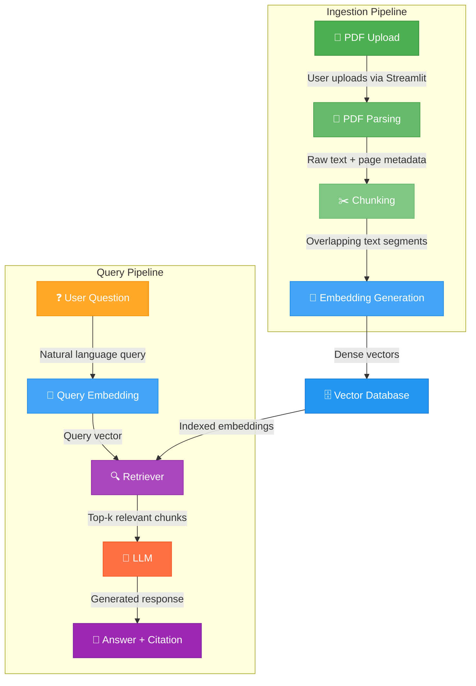

# AskMyBook — Architecture Document

> **Version:** 1.0  
> **Last Updated:** 2025-01-01  
> **Status:** Draft  

---

## Overview

AskMyBook uses a **Retrieval-Augmented Generation (RAG)** architecture to answer questions about PDF documents. The system combines document retrieval with language model generation to produce accurate, citation-backed answers.

This document describes each component in the pipeline, its responsibilities, and how data flows through the system.

---

## Pipeline Architecture



---

## Component Details

### 1. 📄 PDF Upload

| Attribute | Value |
|-----------|-------|
| **Responsibility** | Accept PDF files from the user and persist them on the server |
| **Technology** | FastAPI `UploadFile` + Streamlit `file_uploader` |
| **Input** | PDF file (binary) |
| **Output** | Saved file at `data/raw/<filename>.pdf` |
| **Status** | ✅ Implemented (Week 1) |

The upload component validates that the file is a PDF, generates a safe filename, and writes it to the `data/raw/` directory. The API returns the filename and storage path for confirmation.

**Key design decisions:**
- File size limit will be enforced at 50 MB.
- Duplicate filenames are handled by overwriting (configurable in future).
- Uploaded files are excluded from git via `.gitignore`.

---

### 2. 📝 PDF Parsing

| Attribute | Value |
|-----------|-------|
| **Responsibility** | Extract text content and page-level metadata from PDF documents |
| **Technology** | PyMuPDF (`fitz`) |
| **Input** | PDF file path |
| **Output** | List of `(page_number, text_content)` tuples |
| **Status** | 🔲 Planned (Week 2) |

PyMuPDF is chosen for its speed and ability to preserve page numbers. Each page's text is extracted independently, maintaining the page-to-text mapping that is critical for citations.

**Key considerations:**
- Scanned PDFs (image-based) will not be supported in v1.
- Tables and figures are extracted as raw text.
- Headers/footers may need post-processing to remove noise.

---

### 3. ✂️ Chunking

| Attribute | Value |
|-----------|-------|
| **Responsibility** | Split extracted text into manageable, overlapping segments |
| **Technology** | LangChain `RecursiveCharacterTextSplitter` |
| **Input** | Full document text with page metadata |
| **Output** | List of text chunks with `{text, page_number, chunk_index}` metadata |
| **Status** | 🔲 Planned (Week 2) |

Chunking is necessary because embedding models and LLMs have token limits. The `RecursiveCharacterTextSplitter` respects natural text boundaries (paragraphs → sentences → words) when splitting.

**Configuration parameters:**
- `chunk_size`: 1000 characters (default)
- `chunk_overlap`: 200 characters (default)
- Separators: `["\n\n", "\n", ". ", " ", ""]`

**Why overlap?** Overlapping ensures that information at chunk boundaries isn't lost. A question whose answer spans two chunks will still have relevant content in at least one of them.

---

### 4. 🔢 Embedding Generation

| Attribute | Value |
|-----------|-------|
| **Responsibility** | Convert text chunks (and queries) into dense vector representations |
| **Technology** | Sentence Transformers (`all-MiniLM-L6-v2`) |
| **Input** | Text string |
| **Output** | 384-dimensional float vector |
| **Status** | 🔲 Planned (Week 2) |

Embeddings capture semantic meaning — similar texts produce similar vectors. The `all-MiniLM-L6-v2` model offers a strong balance between quality and speed:

| Property | Value |
|----------|-------|
| Dimensions | 384 |
| Max tokens | 256 |
| Speed | ~14,000 sentences/sec on GPU |
| Model size | 80 MB |

**Why not OpenAI embeddings?** Using a local model avoids API costs and latency for the embedding step. OpenAI embeddings (`text-embedding-3-small`) remain an option for future comparison.

---

### 5. 🗄️ Vector Database

| Attribute | Value |
|-----------|-------|
| **Responsibility** | Store, index, and query embedding vectors efficiently |
| **Technology** | ChromaDB |
| **Input** | Embedding vectors + metadata |
| **Output** | Top-k nearest neighbor results |
| **Status** | 🔲 Planned (Week 3) |

ChromaDB provides:
- **Persistent local storage** — data survives restarts.
- **Metadata filtering** — filter by document ID, page number, etc.
- **HNSW indexing** — fast approximate nearest neighbor search.

**Storage structure:**
```
Collection: "documents"
├── Document 1 chunks (vectors + metadata)
├── Document 2 chunks (vectors + metadata)
└── ...
```

Each stored entry includes:
- `id`: Unique chunk identifier
- `embedding`: 384-dim vector
- `document`: Original chunk text
- `metadata`: `{filename, page_number, chunk_index}`

---

### 6. 🔍 Retriever

| Attribute | Value |
|-----------|-------|
| **Responsibility** | Find the most relevant document chunks for a given query |
| **Technology** | ChromaDB similarity search (cosine distance) |
| **Input** | Query embedding vector |
| **Output** | Top-k chunks with similarity scores |
| **Status** | 🔲 Planned (Week 3) |

The retriever:
1. Embeds the user's question using the same model.
2. Queries ChromaDB for the `top_k` (default: 5) most similar chunks.
3. Returns chunks sorted by relevance, including their metadata.

**Retrieval strategy:** Start with simple cosine similarity. Future improvements could include:
- Hybrid search (keyword + semantic)
- Re-ranking with a cross-encoder
- Maximum Marginal Relevance (MMR) for diversity

---

### 7. 🤖 LLM (Large Language Model)

| Attribute | Value |
|-----------|-------|
| **Responsibility** | Generate a natural-language answer from retrieved context |
| **Technology** | OpenAI GPT-3.5-turbo / GPT-4 |
| **Input** | System prompt + retrieved chunks + user question |
| **Output** | Generated answer text |
| **Status** | 🔲 Planned (Week 3) |

The LLM receives a carefully constructed prompt:

```
System: You are a helpful assistant that answers questions based on 
the provided document context. Always cite the page number(s) where 
you found the information. If the answer is not in the context, say 
"I couldn't find this information in the document."

Context:
[Page 12] "The mitochondria is the powerhouse of the cell..."
[Page 15] "ATP is produced through oxidative phosphorylation..."

Question: What produces ATP in the cell?
```

**Key design decisions:**
- **Temperature:** 0.0 (deterministic, factual answers)
- **Max tokens:** 500 (concise answers)
- **Model:** GPT-3.5-turbo (cost-effective); GPT-4 available for higher accuracy

---

### 8. 💬 Answer + Citation

| Attribute | Value |
|-----------|-------|
| **Responsibility** | Present the generated answer with source citations |
| **Technology** | Streamlit UI components |
| **Input** | LLM response + chunk metadata |
| **Output** | Formatted answer with clickable page references |
| **Status** | 🔲 Planned (Week 4) |

The final output includes:
- **Answer text** — the LLM's natural-language response.
- **Citations** — page numbers extracted from chunk metadata.
- **Source snippets** — expandable sections showing the original text.
- **Confidence indicator** — based on retrieval similarity scores.

---

## System Context Diagram

```
┌─────────────────────────────────────────────────────────┐
│                     AskMyBook System                     │
│                                                          │
│  ┌──────────┐    ┌──────────────┐    ┌───────────────┐  │
│  │ Streamlit │◄──►│   FastAPI    │◄──►│  ChromaDB     │  │
│  │ (Port     │    │  (Port 8000) │    │  (Persistent) │  │
│  │  8501)    │    └──────┬───────┘    └───────────────┘  │
│  └──────────┘           │                                │
│                         ▼                                │
│                  ┌──────────────┐                        │
│                  │  File System │                        │
│                  │  data/raw/   │                        │
│                  └──────────────┘                        │
└─────────────────────────────────────────────────────────┘
                          │
                          ▼
                  ┌──────────────┐
                  │  OpenAI API  │
                  │  (External)  │
                  └──────────────┘
```

---

## Technology Versions

| Technology | Minimum Version | Notes |
|-----------|----------------|-------|
| Python | 3.10+ | Required for modern type hints |
| FastAPI | 0.104+ | Lifespan context manager support |
| Streamlit | 1.29+ | File uploader improvements |
| PyMuPDF | 1.23+ | Latest text extraction improvements |
| ChromaDB | 0.4+ | Persistent client API |
| Sentence Transformers | 2.2+ | Stable `encode()` API |
| OpenAI SDK | 1.6+ | New client-based API |

---

## Future Architecture Considerations

1. **Message Queue** — For async PDF processing of large documents.
2. **Caching Layer** — Redis for frequently asked questions.
3. **Load Balancer** — Nginx for horizontal scaling.
4. **Monitoring** — Prometheus + Grafana for observability.
5. **CI/CD** — GitHub Actions for automated testing and deployment.
